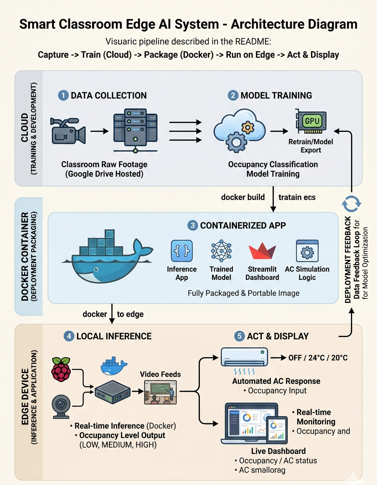

# Smart Classroom Edge AI System

An Edge AI-powered system that detects classroom occupancy from video, performs real-time inference on an edge device, automatically simulates air conditioning control, and provides live monitoring through a web dashboard.

**Course:** Edge Computing | **Instructor:** Thulasee Shan | **University of Jaffna, Class of 2026**

---

## Overview

This project implements an end-to-end Edge AI pipeline for smart classroom management. It classifies classroom occupancy into **LOW**, **MEDIUM**, and **HIGH** levels from video footage, runs inference locally on an edge device, and drives an automated air conditioning response based on the detected occupancy — all visualized through a live Streamlit dashboard.

## Key Features

- **Occupancy Detection** — Classifies real classroom video into LOW / MEDIUM / HIGH occupancy levels.
- **Edge Inference** — Model runs locally on the edge device; no cloud dependency during runtime.
- **Automated AC Simulation** — AC state (OFF / 24°C / 20°C) responds automatically to live occupancy.
- **Live Dashboard** — Real-time monitoring of occupancy, AC state, temperature, and runtime.
- **Containerized Deployment** — Fully packaged with Docker for consistent, portable installation.
- **MLOps Workflow** — Supports retraining, model export, and redeployment as new data is collected.

## Architecture



Video is captured and used to train a classification model in the cloud. The trained model is exported to an optimized runtime format, containerized using Docker, and deployed to execute local inference on the edge device. The detected occupancy categories dynamically update the simulated AC logic and are surfaced live on the Streamlit dashboard.

## Project Structure

```text
Smart_Classroom_Edge_AI_System/
├── dashboard/         # Streamlit web dashboard (app, utils, requirements)
├── docker/            # Dockerfile and container configuration
├── model/             # Trained occupancy detection model, labels, and evaluation scripts
├── dataset/           # Dataset documentation and sample classroom footage
├── documentation/     # Project documentation & visual assets
├── .gitignore
├── LICENSE
└── README.md
```

## Dataset

Sample classroom footage and full dataset documentation are available in [`dataset/`](./dataset). The complete raw video dataset used for training exceeds GitHub's practical storage limits, so it is hosted externally on Google Drive — the access link is provided in the `dataset/` folder's documentation. This repository includes only sample clips and dataset metadata; no raw training footage is stored in version control.

## How to Setup and Run Locally

### Prerequisites
- [Docker Desktop](https://www.docker.com/products/docker-desktop/) installed and running.

### Build and Run

Execute the following commands from the **root directory** of the repository:

```bash
# Build the container from the project root using the specific Dockerfile path
docker build -t smart-classroom-edge-ai -f docker/Dockerfile .

# Run the container in detached mode mapping the Streamlit port
docker run -d -p 8501:8501 smart-classroom-edge-ai
```

After launching, open **http://localhost:8501** in your web browser to access the dashboard.

> 💡 **Tip:** For optimal results within the user interface, set the **Detection Confidence Threshold** value to `0.15`.

### Stopping the Container

```bash
docker stop <container_id>
```

## Team Structure

| Role | Responsibilities |
|---|---|
| **Product Owner** | Requirement gathering, system architecture design, final technical demonstration. |
| **Project Manager / Scrum Master** | Team coordination, progress tracking, repository management, presentation management. |
| **App Developers** | Edge application development, dashboard interface design, AC simulation state machine. |
| **Data Scientists** | Dataset collection & labeling, model training, model deployment optimization & MLOps setup. |

## Privacy & Ethics

All training footage excludes visible faces and participants under the age of 15, in accordance with dataset collection guidelines. Explicit consent was secured from all individuals appearing in the recorded footage.

## License

This project is licensed under the terms specified in [LICENSE](./LICENSE).
